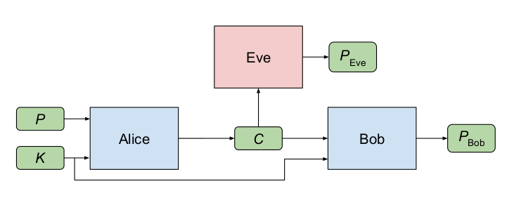

# Neural Cryptography

>Can neural networks can learn to use secret keys to protect information from other neural networks? Cryptography is broadly concerned with algorithms and protocols that ensure the secrecy and integrity of information. But, Neural networks are generally not meant to be great at cryptography. Famously, the simplest neural networks cannot even compute XOR, which is basic to many cryptographic algorithms. Nevertheless, neural networks can learn to protect the confidentiality of their data from other neural networks: they discover forms of encryption and decryption, without being taught specific algorithms for these purposes.

>This project involves three parties: Alice, Bob, and Eve. Typically, Alice and Bob wish to communicate securely, and Eve wishes to eavesdrop on their communications. After a bit of training, however, Eve may start to break this code. With some more training, Alice and Bob may discover refinements, in particular codes that exploit the key material better. Eve eventually finds it impossible to adjust to those codes.

## Encryption and Decryption Blocks
<p align="center">

</p>
<p align="center">
Alice, Bob, and Eve, with a symmetric cryptosystem. Here, “P” stands for “plaintext”, “C” stands for
“ciphertext” and "K" stands for Key
</p>

## Objectives and Important Points
>1. Eve’s goal is simple: to reconstruct P accurately, in other words, to minimize the error between P and P-eve.
>2. Alice and Bob want to communicate clearly (to minimize the error between P and P-bob), but also to hide their communication from Eve.
>3. A more realistic and useful goal for Alice and Bob is, generally, to minimize the mutual information between Eve’s guess and the real plaintext.
>4. in the definitions of GANs, we would like Alice and Bob to defeat the best possible version of Eve, rather than a fixed Eve.
>5. in the training of Alice and Bob, we do not attempt to maximize Eve’s reconstruction error. If we did, and made Eve completely wrong, then Eve could be completely right in the next iteration by simply flipping all output bits!

## Usage
```
- Run the Notebook on Jupyter or Google colab environment.
```
## References
>1. Martín Abadi, David G. Andersen, ***Learning to Protect Communications with Adversarial Neural Cryptography***, 2016
>2. Alexander KlimovAnton MityaginAdi Shamir, ***Analysis of Neural Cryptography***, 2016
>3. Eva Volna, Martin Kotyrba, Vaclav Kocian, Michal Janosek, ***Cryptography Based On Neural Network***, 2016
>4. R. Mislovaty, E. Klein, I. Kanter, W. Kinzel, ***Security of neural cryptography***, 2004